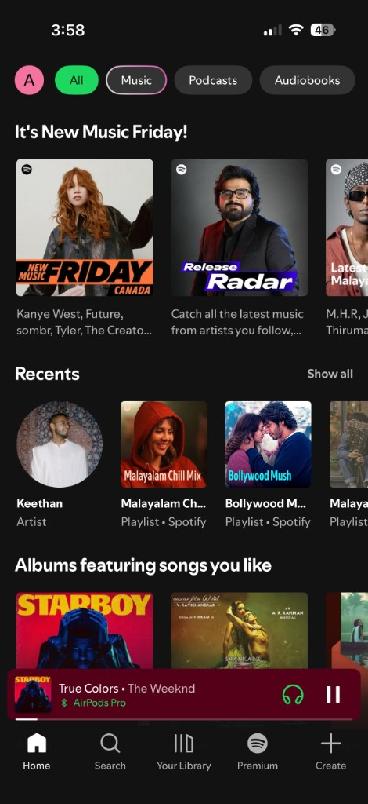
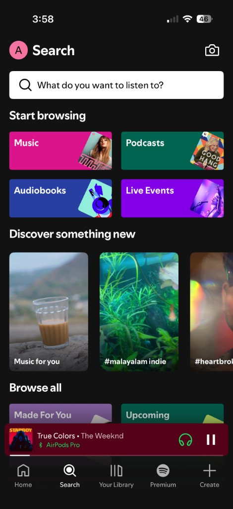
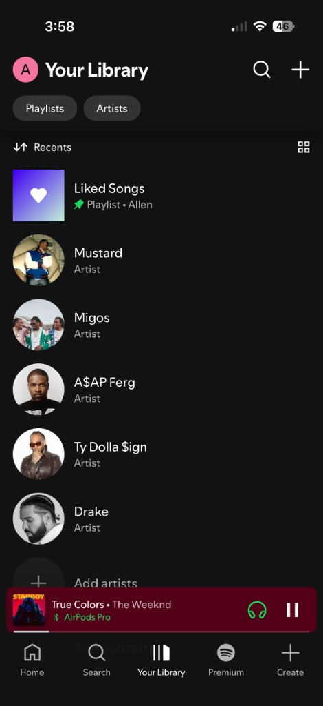
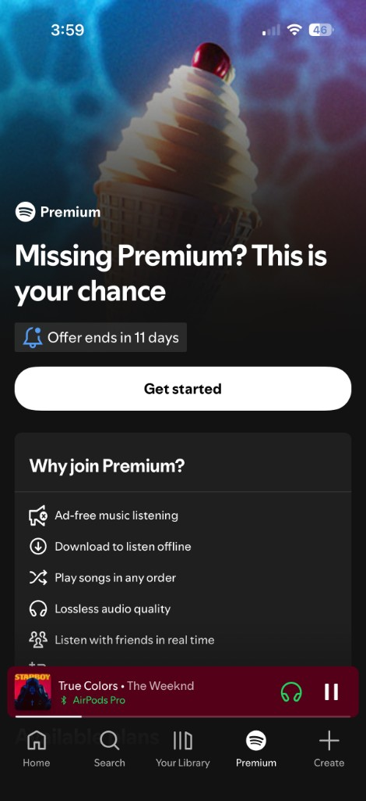
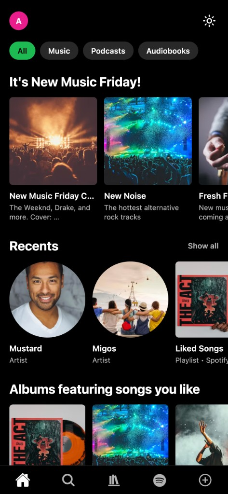
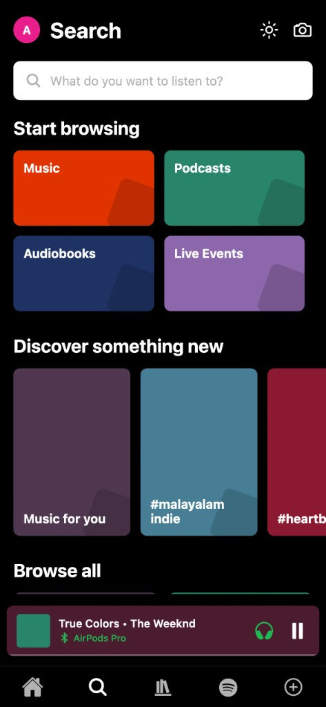
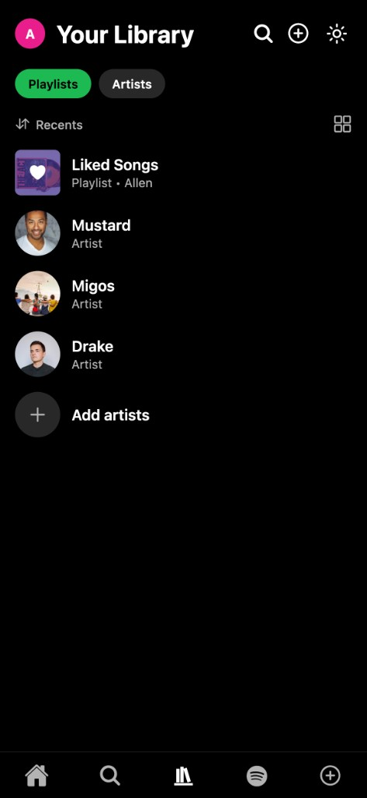
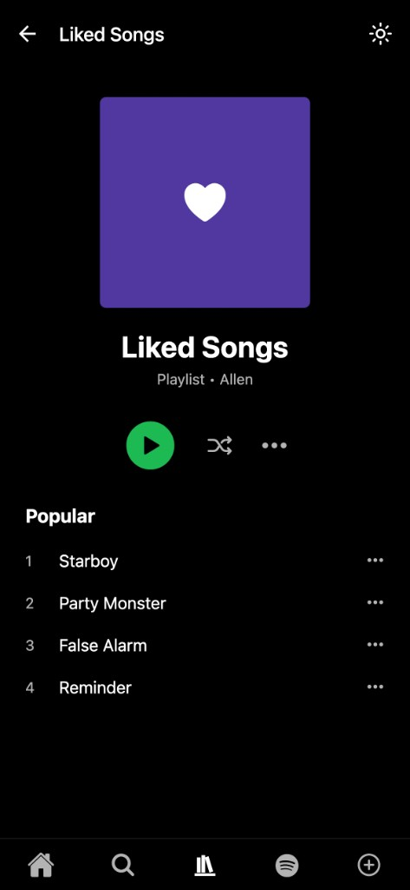
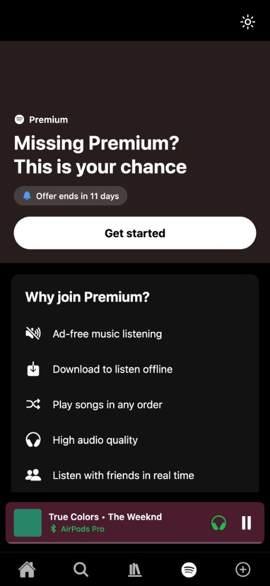

# Spotifi

A Spotify-inspired multi-screen mobile app built with **Expo**, **TypeScript**, and **Expo Router** for the assignment *Advanced Multi-Screen Mobile Application with Collaborative Navigation* (CPRG 303 B, Spring 2026).

## Reference Application

The reference app chosen is **Spotify**. The goal was to recreate its navigation structure and core screen layouts using placeholder content instead of real album art or audio playback.

### Reference Screenshots

| Home | Search |
|:---:|:---:|
|  |  |

| Your Library | Premium |
|:---:|:---:|
|  |  |

## What Was Built

### Assignment Requirements

| Requirement | Implementation |
|---|---|
| Expo + TypeScript | Expo SDK 56 with TypeScript |
| File-based routing | Expo Router (`app/` directory) |
| Minimum 4 screens | 6 screens (Home, Search, Library, Library Detail, Premium, Create) |
| Tab navigation (3+ tabs) | 5-tab bottom navigator |
| Stack navigation | Library tab: list → detail |
| Dynamic content | `FlatList` on Library screen with reusable `LibraryListItem` |
| Route parameters | `router.push('/library/[id]')` + `useLocalSearchParams` |
| Icons & styling | `@expo/vector-icons` + `StyleSheet` |
| **Bonus:** Light/dark theme | `ThemeContext` with manual toggle (sun/moon icon) |

### Navigation Structure

```
Root (ThemeProvider)
└── Tabs (5 tabs + mini-player)
    ├── Home
    ├── Search
    ├── Library (Stack)
    │   ├── index      → Your Library list
    │   └── [id]       → Playlist / artist detail
    ├── Premium
    └── Create
```

### Screens

- **Home** — Filter chips, horizontal carousels (New Music Friday, Recents, Albums)
- **Search** — Search bar, browse grid, discover row
- **Your Library** — Filter chips, sort row, scrollable list of playlists and artists
- **Library Detail** — Opened by tapping a library item; shows title, metadata, and track list
- **Premium** — Promotional hero and feature list
- **Create** — Placeholder screen for the fifth tab

### Key Features

- **Reusable components:** `LibraryListItem`, `FilterChip`, `HorizontalCard`, `BrowseCard`, `MiniPlayer`, `ThemeToggle`
- **Mock data:** Centralized in `constants/mockData.ts`
- **Theming:** Spotify-style dark palette with light mode support and a top-right theme toggle
- **Mini-player:** Persistent playback bar above the tab bar on main screens

## App Screenshots

| Home | Search |
|:---:|:---:|
|  |  |

| Your Library | Liked Songs (Detail) |
|:---:|:---:|
|  |  |

| Premium | Create |
|:---:|:---:|
|  |  |

## Tech Stack

- [Expo](https://expo.dev/) ~56
- [Expo Router](https://docs.expo.dev/router/introduction/) ~56
- React Native 0.85
- TypeScript
- `@expo/vector-icons`
- `react-native-safe-area-context`

## Project Structure

```
spotifi/
├── app/
│   ├── _layout.tsx              # Root layout + ThemeProvider
│   └── (tabs)/
│       ├── _layout.tsx          # 5-tab navigator + mini-player
│       ├── index.tsx            # Home
│       ├── search.tsx
│       ├── library/             # Stack navigator
│       ├── premium.tsx
│       └── create.tsx
├── components/                  # Reusable UI components
├── constants/                   # Colors, mock data
├── context/                     # ThemeContext
├── types/                       # TypeScript interfaces
└── docs/images/                 # Reference & app screenshots
```

## Getting Started

### Prerequisites

- Node.js 18+
- [Expo Go](https://expo.dev/go) on a physical device, or Xcode / Android Studio for simulators

### Install & Run

```bash
npm install
npm start
```

Then press `i` for iOS simulator, `a` for Android emulator, or scan the QR code with Expo Go.

## Notes

- Album art uses colored placeholder blocks rather than remote images.
- Search input and playback controls are visual only (no real audio).
- The app defaults to the system light/dark mode; use the sun/moon icon to toggle manually.

## Author

**Allen John** — Student ID: 000961216  
**Course:** CPRG 303 B — Mobile Application Development (Spring 2026)  
**Institution:** SAIT
